<div align="center">

# 🍃 Nectar

**Интернет-магазин продуктов: мобильное приложение для покупателей и курьеров + веб-панель управления**


Курсовой проект (МДК 01.01): информационная система интернет-магазина продуктов.

</div>

---

## Содержание

- [Возможности](#возможности)
- [Скриншоты](#скриншоты)
- [Архитектура](#архитектура)
- [Технологии](#технологии)
- [Структура репозитория](#структура-репозитория)
- [Модель данных](#модель-данных)
- [Безопасность](#безопасность)
- [Быстрый старт](#быстрый-старт)
- [Тестирование](#тестирование)
- [Деплой](#деплой)
- [Известные ограничения](#известные-ограничения)
- [Соглашения по разработке](#соглашения-по-разработке)

## Возможности

| Роль | Где работает | Что умеет |
| --- | --- | --- |
| 🛒 **Покупатель** | мобильное приложение | каталог с поиском, фильтрами и сортировкой, избранное, корзина с контролем остатков, промокоды, оформление заказа (адрес, время, оплата картой или наличными), отслеживание статуса, уведомления, профиль с аватаром, смена пароля, RU/EN |
| 🚚 **Курьер** | мобильное приложение | вкладка **«Свободные»**: пул неназначенных заказов, «Взять заказ» (два курьера не возьмут один: транзакция), «Вернуть в пул» до выезда; вкладка **«Мои заказы»**: активные и история, адрес, состав, телефон клиента (копируется), сумма к получению наличными, «Начать доставку» → «Подтвердить доставку» с подтверждением; уведомления о назначениях |
| 🧑‍💼 **Менеджер** | веб-панель | дашборд, товары, категории, производители, промокоды, заказы (смена статуса, назначение курьера), просмотр поставщиков и пользователей |
| 👑 **Администратор** | веб-панель | всё, что у менеджера, плюс поставщики, роли и блокировка пользователей, восстановление скрытого |

Отдельно:

- 🔐 вход по email **или логину**, регистрация с валидацией, восстановление пароля, Google Sign-In;
- 📦 остатки списываются в транзакции, при отмене заказа возвращаются на склад;
- 🌐 полная локализация мобильного приложения и веб-панели (русский и английский);
- 🛡️ правила безопасности Firestore покрыты автотестами на локальном эмуляторе.

## Скриншоты

### Мобильное приложение

<table>
  <tr>
    <td align="center">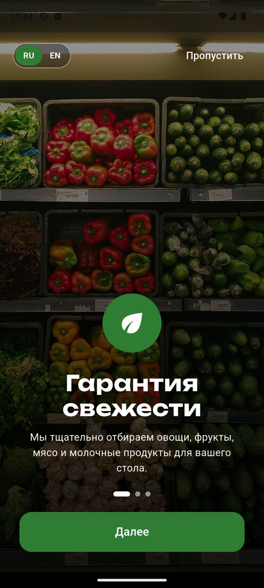<br><sub>Онбординг</sub></td>
    <td align="center">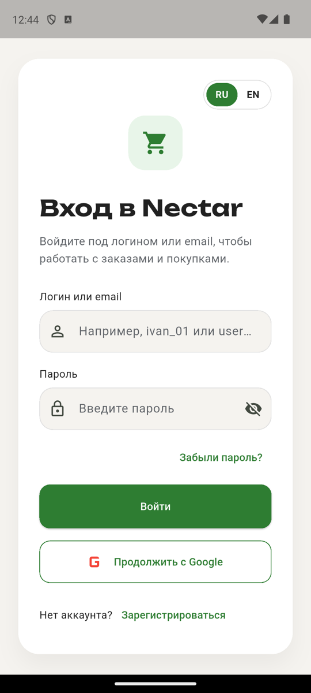<br><sub>Вход</sub></td>
    <td align="center">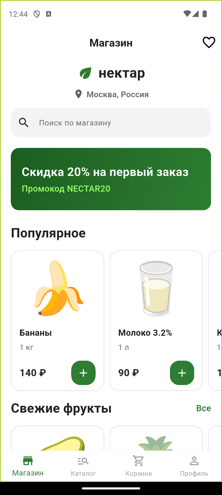<br><sub>Магазин</sub></td>
    <td align="center">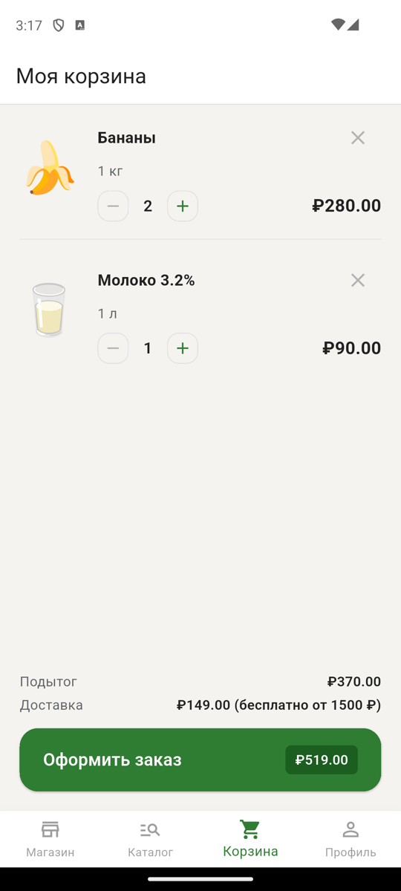<br><sub>Корзина</sub></td>
  </tr>
  <tr>
    <td align="center">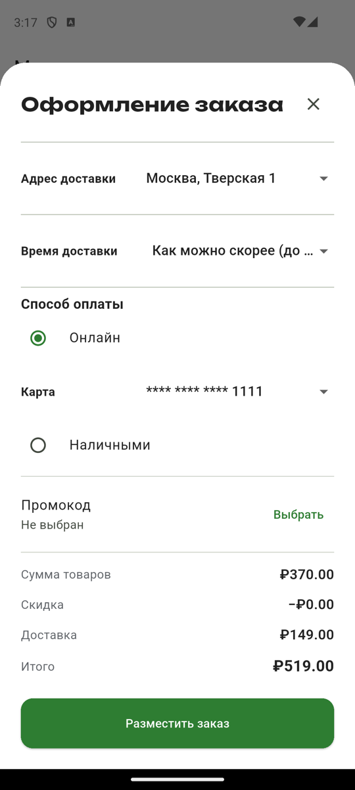<br><sub>Оформление заказа</sub></td>
    <td align="center">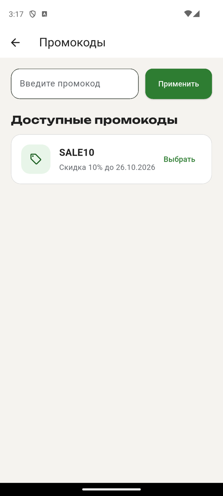<br><sub>Промокоды</sub></td>
    <td align="center">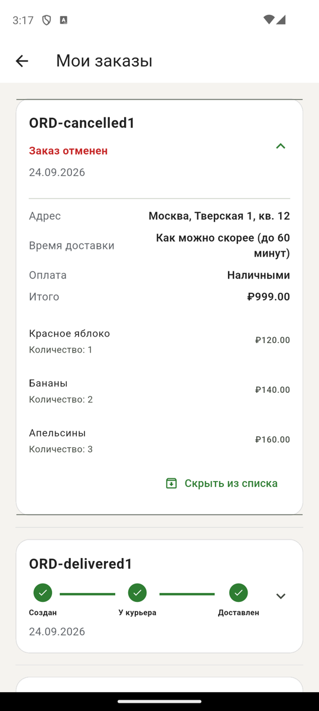<br><sub>Мои заказы</sub></td>
    <td align="center">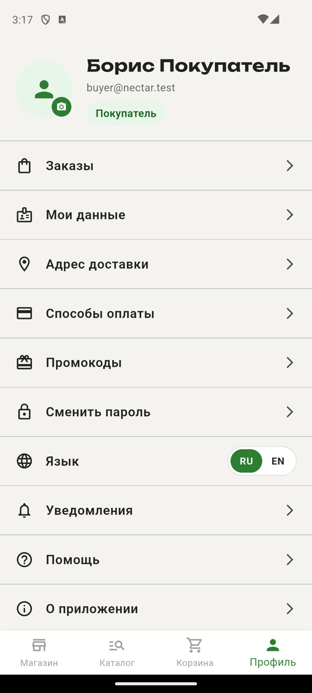<br><sub>Профиль</sub></td>
  </tr>
</table>

### Курьер

<table>
  <tr>
    <td align="center">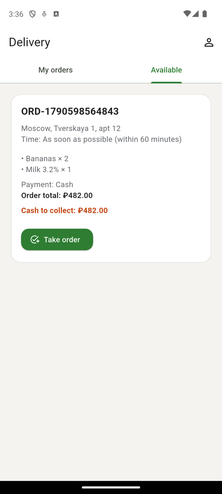<br><sub>Свободные заказы</sub></td>
    <td align="center">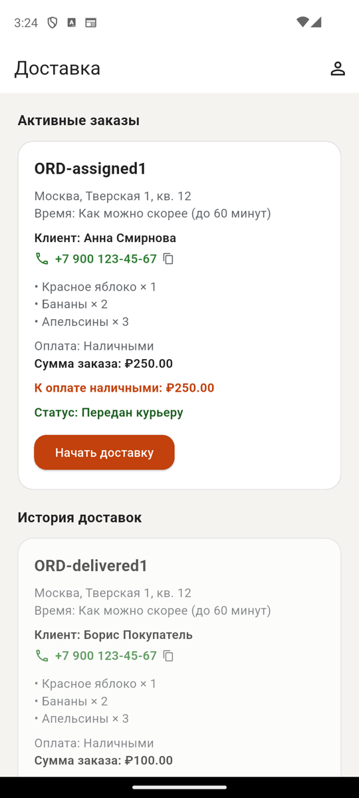<br><sub>Мои заказы и история</sub></td>
    <td align="center">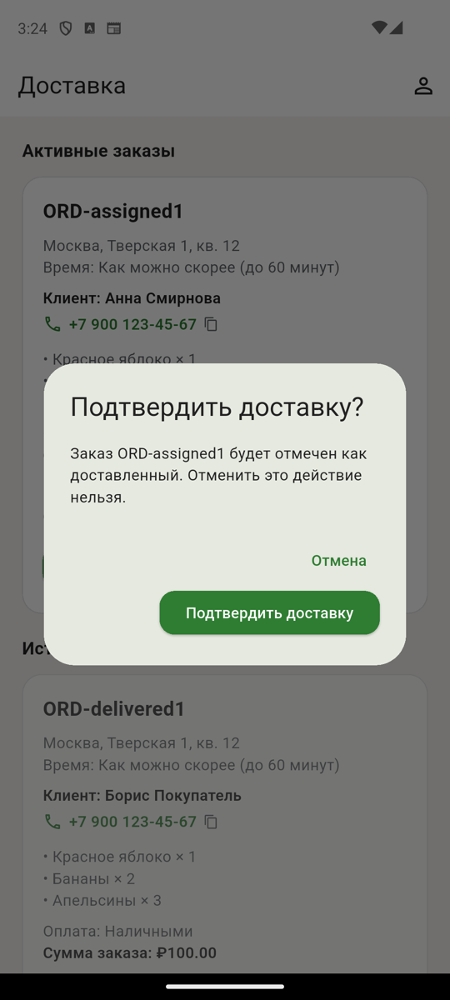<br><sub>Подтверждение доставки</sub></td>
    <td align="center">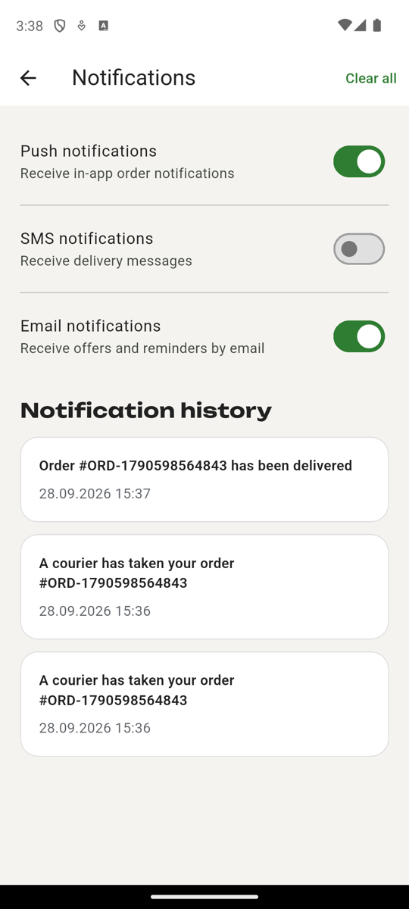<br><sub>Уведомления и переключатели</sub></td>
  </tr>
</table>

### Веб-панель администратора

| | |
| --- | --- |
| 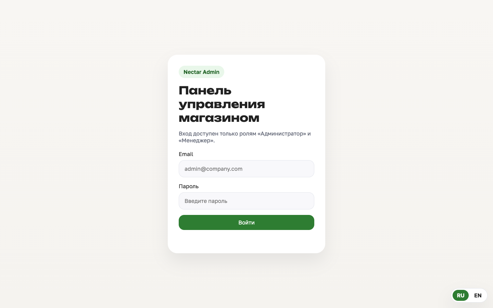 | 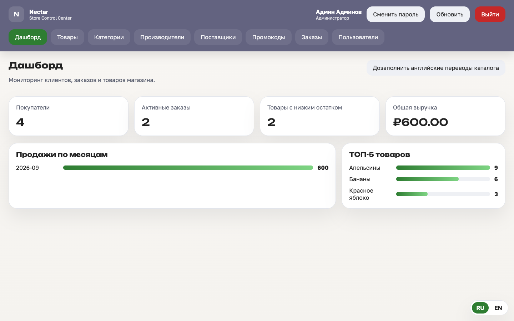 |
| **Вход** (только admin и manager) | **Дашборд**: выручка, активные заказы, топ товаров |
| 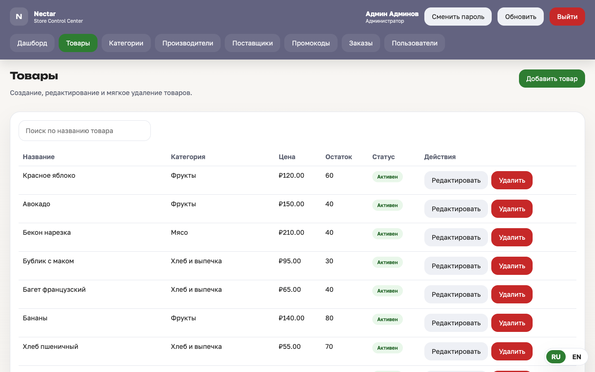 | 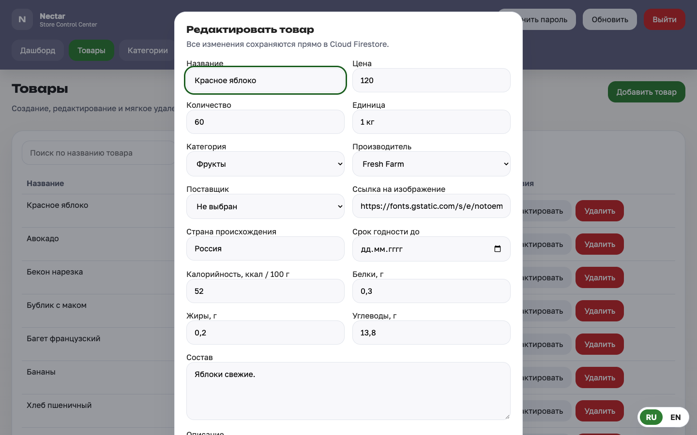 |
| **Товары**: поиск, скрытие и восстановление | **Форма товара** с валидацией |
| 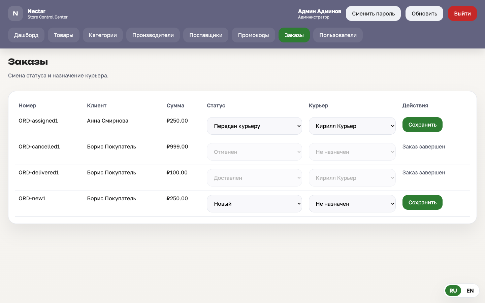 | 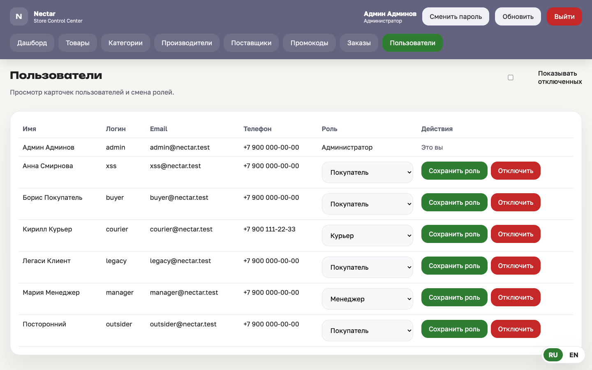 |
| **Заказы**: статус и назначение курьера | **Пользователи**: роли и блокировка |

> Скриншоты сняты на локальных эмуляторах Firebase с демо-данными (`SEED_DEMO=1`, см. [Быстрый старт](#быстрый-старт)).

## Архитектура

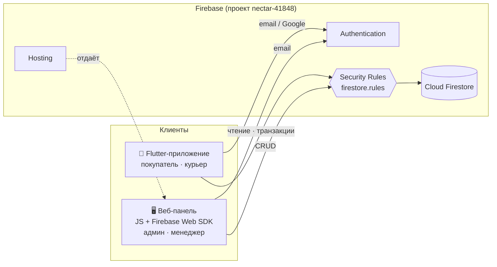

Ключевые решения:

- **Бэкенд без серверного кода.** Вся авторизация данных — в правилах Firestore. Роль хранится в `users/{uid}.role` и проверяется правилами при каждом обращении.
- **Заказ оформляется транзакцией:** проверка остатков → списание → создание заказа → счётчик промокода. Цены берутся из базы, а не с клиента.
- **Вход по логину** без раскрытия профилей: публичный индекс `loginIndex/{логин}` хранит только `{uid, email}`; создать запись можно лишь для своей почты.
- **Без Firebase Storage** (он платный): аватары хранятся в профиле как base64-JPEG (до 150 КБ, сжатие на устройстве).
- **Жизненный цикл сессии:** `MaterialApp` пересоздаётся при смене пользователя, поэтому диалоги и роуты предыдущей сессии не остаются в дереве виджетов.

## Технологии

| Слой | Стек |
| --- | --- |
| Мобильное приложение | Flutter 3, Dart 3.9, Provider, `intl` + ARB-локализация |
| Веб-панель | ванильный JS (ES-модули), Firebase Web SDK 10, без сборщика |
| Бэкенд | Firebase Authentication, Cloud Firestore, Firebase Hosting |
| Тесты | `flutter_test`, `fake_cloud_firestore`, Node `node:test`, `@firebase/rules-unit-testing`, Firebase Emulator Suite |

## Структура репозитория

```text
lib/
  app/            тема и оболочка сессии (SessionApp)
  data/           стартовый каталог и переводы
  l10n/           ARB и сгенерированная локализация (RU/EN)
  models/         Product, User, Order, Category
  providers/      корзина, избранное, язык (Provider)
  screens/        auth · shop · explore · cart · account · courier · favorites
  services/       AuthService, DatabaseService (вся работа с Firestore)
  utils/          валидаторы, цены, роли, логика курьера
web/              веб-панель (index.html, admin.js, validation.js, i18n.js)
test/             Dart-тесты
tool/
  rules-test/     тесты правил Firestore + unit-тесты веб-панели + seed эмулятора
  strings/        источник строк локализации (Python → ARB)
firestore.rules   правила безопасности
firebase.json     правила, hosting, эмуляторы
docs/screenshots/ изображения для README
```

## Модель данных

| Коллекция | Назначение |
| --- | --- |
| `users` | профиль: `role` (`admin` · `manager` · `courier` · `buyer`), адреса, карты (маски), избранное, `isDeleted`, `photoData` |
| `loginIndex` | `логин → {uid, email}` для входа по логину |
| `products` · `categories` · `manufacturers` · `suppliers` | каталог и справочники |
| `orders` | заказ: позиции, суммы, `statusId`, `courierId`, `userConfirmed`, `hiddenByUser` |
| `orderStatuses` · `roles` | справочники статусов и ролей |
| `promoCodes` | код, скидка 1–99 %, срок, счётчик использований |
| `notifications` | уведомления покупателям и курьерам (двуязычный текст) |

Статусы заказа: `new → processing → assigned → delivering → delivered`, а также `cancelled`.
Завершённые (`delivered`, `cancelled`) заказы неизменяемы.

## Безопасность

Правила лежат в [`firestore.rules`](firestore.rules) и проверяются 38 тестами. Кратко:

- покупатель видит только свой профиль и заказы; может лишь уменьшать остаток товара (не больше 99 за запись) и увеличивать счётчик промокода при оформлении;
- скидка в заказе обязана совпадать с промокодом, на который он ссылается;
- курьер видит и двигает статус только своих **активных** заказов, а также видит пул свободных (без курьера, `new`/`processing`), может взять заказ (`courierId` = он сам, статус `assigned`) и вернуть его в пул до выезда;
- роли и блокировку меняет только администратор; заблокированный не может снять блокировку, а самоудаление можно откатить;
- запись в `loginIndex` возможна только для своей почты из токена;
- заказы не удаляются (финансовая отчётность);
- веб-панель экранирует все данные при выводе (защита от XSS) и отдаёт заголовки `X-Frame-Options`, `X-Content-Type-Options`.

> Ключи из `google-services.json` / `firebase_options.dart` — публичные клиентские идентификаторы Firebase, а не секреты; доступ к данным ограничивают правила.

## Быстрый старт

### Требования

Flutter 3.x (Dart ≥ 3.9), Node.js ≥ 20, Firebase CLI, Java (для эмуляторов), Android Studio или Xcode.

### Мобильное приложение

```bash
flutter pub get
flutter run                        # против боевого проекта Firebase
```

### Локальный бэкенд на эмуляторах (без риска для боевой базы)

```bash
# 1. Эмуляторы Auth + Firestore
firebase emulators:start --only auth,firestore --project nectar-41848

# 2. Демо-данные: каталог из lib/data, пользователи, заказы
cd tool/rules-test && npm install
SEED_DEMO=1 node seed-emulator.mjs          # SEED_MINIMAL=1 — только админ и каталог, остальных создаёте через приложение; catalog.json обновляется: dart run tool/dump_catalog.dart > tool/rules-test/catalog.json

# 3. Веб-панель: http://localhost:8090/?emulator=1
python3 -m http.server 8090 -d ../../web

# 4. Приложение на эмуляторе
flutter run --dart-define=FIREBASE_EMULATOR=localhost      # Android-эмулятор: 10.0.2.2
```

Тестовые пользователи (пароль `Test1234`): `admin@nectar.test`, `manager@nectar.test`,
`courier@nectar.test`, `buyer@nectar.test`. Параметр `?emulator=1` и флаг `FIREBASE_EMULATOR`
работают только на localhost и в debug-сборке.

## Тестирование

```bash
flutter analyze
flutter test                        # 78 тестов
cd tool/rules-test && npm test      # 21 unit-тест веб-панели + 38 тестов правил
```

| Что проверяется | Где |
| --- | --- |
| валидаторы, корзина, расчёт доставки, модели, тема переключателей | `test/*.dart` |
| `DatabaseService`: заказ, остатки, промокоды, логины, аватар (fake Firestore) | `test/database_service_test.dart` |
| логика курьера: группировка, переходы; взятие и возврат заказа в транзакции | `test/courier_orders_test.dart`, `test/database_service_test.dart` |
| локализация: одинаковые ключи, нет «сырых» `\n`, безопасные аргументы | `test/localization_test.dart`, `arb_text_test.dart`, `l10n_args_test.dart` |
| сессия: выход с открытым диалогом и роутом | `test/session_app_test.dart` |
| правила Firestore на эмуляторе (роли, заказы, промокоды, логины) | `tool/rules-test/firestore.rules.test.mjs` |
| валидация форм и расчёты веб-панели | `tool/rules-test/validation.test.mjs` |

## Деплой

```bash
firebase deploy --only firestore:rules      # правила безопасности
firebase deploy --only hosting              # веб-панель (папка web/)
```

После деплоя hosting панель доступна по адресу `https://nectar-41848.web.app`.
Стартовый каталог загружается один раз кнопкой «Перезалить базу товаров»
(`DatabaseService.reseedCatalog()`, данные в `lib/data/product_catalog.dart`), приложение при запуске в базу ничего не пишет.
Роль пользователя меняется в поле `users/{uid}.role` (первого администратора назначают вручную в консоли Firebase).

## Известные ограничения

- Цены и итог заказа считает клиент; правила проверяют владельца, статус и скидку, но не пересчитывают сумму. Полная защита требует Cloud Functions (платный тариф Blaze).
- Переключатели push/SMS/email в профиле сохраняют настройку, но рассылка не реализована.
- У курьера нет карты и построения маршрута.
- `lib/screens/web/` — заглушка админки на Flutter Web; рабочая админка — JS-панель в `web/`.
- iOS-сборка не проверялась (нужна платформа iOS в Xcode), проверено на Android-эмуляторе и в браузере.

## Соглашения по разработке

- Коммиты по [Conventional Commits](https://www.conventionalcommits.org/ru/): `feat`, `fix`, `test`, `docs`, `chore`, `refactor`.
- Строки интерфейса правятся в `tool/strings/*.py`, затем `python3 tool/build_arb.py && flutter gen-l10n`.
- Перед изменением `firestore.rules` запускать `npm test` в `tool/rules-test`.
